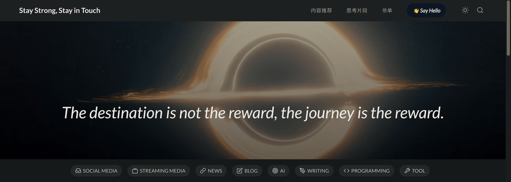

# 轻度失效 Normal Invalidation

  

轻度失效 (Normal Invalidation) 是一个使用原生的 HTML、SCSS 和 JavaScript 开发的，旨在作为一个代替浏览器收藏夹的“集成式”网站导航页。它允许用户自定义添加、编辑和删除网站链接，以方便快速访问常用的网站。[English Docs](./README_EN.md)

功能特点：

- 使用原生的 HTML、SCSS 和 JavaScript 开发，无需依赖第三方框架或库。
- 提供集成式的网站导航页，代替传统的浏览器收藏夹。
- 可自定义添加、编辑和删除网站链接，以适应个人需求。
- 界面简洁、直观，易于使用和导航。
- 支持白天/黑夜模式切换。
- 采用响应式设计，进而适应不同设备的屏幕尺寸。

## Getting Started

克隆或下载本项目到本地计算机，添加、编辑或删除你的网站链接。

## Planned Actions

- [ ] **采用 Vue.js 重构网站，更新设计**：将现有网站迁移到 Vue.js 框架，利用其强大的组件化和响应式能力，以提升网站的性能和可维护性。重新设计用户界面，注重用户体验和现代化的视觉效果。
- [ ] **引入 Next.js 重写网站**：使用 Next.js 框架重新实现网站，利用其组件化和虚拟 DOM 的特性，提升网站的性能和开发效率。
- [ ] **引入响应式框架**：考虑将现有网站迁移到一个现代的响应式框架，如 Bootstrap 或 Tailwind CSS，以实现更好的跨设备兼容性和可访问性。
- [ ] **开发浏览器插件**：创建一个浏览器插件，使用户能够方便地访问网站导航页，并在新标签页或侧边栏中快速打开链接。
- [ ] **支持拖放和排序**：实现拖放功能，允许用户通过拖动链接来重新排序和组织他们的网站导航。

## Contribute

如果有任何有趣的想法，可以在 [issue](https://github.com/Egcoo/egcoo.github.io/issues) 中告诉我，同时也欢迎各种 pull requests.

## License

This project is under [GPL-3.0](./LICENSE) license, feel free to use it under the license.
