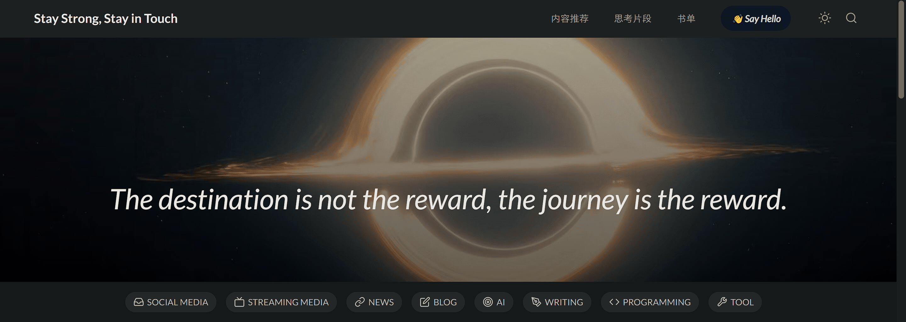

# 轻度失效 Normal Invalidation

  

轻度失效 (Normal Invalidation) is an "integrated" website navigation page developed using native HTML, SCSS and JavaScript and intended to serve as a replacement for browser favorites. It allows users to custom add, edit and delete website links to facilitate quick access to frequently used websites.

It provides a number of features that make it easy to use silky ：

- Develop using native HTML, SCSS, and JavaScript without relying on third-party frameworks or libraries.
- Provide integrated website navigation page instead of traditional browser favorites.
- Website links can be customized to add, edit and delete to suit personal needs.
- The interface is simple, intuitive and easy to use and navigate.
- Support day/night mode switching.
- Use responsive design to adapt to different device screen sizes.

## Getting Started

Clone or download this project to your local computer and add, edit or delete links to your website.

## Planned Actions

- [ ] **Reconstruct the website using Vue.js and update the design**: Migrate the existing website to the Vue.js framework and use its powerful componentization and responsiveness capabilities to improve the performance and maintainability of the website. The user interface has been redesigned with a focus on user experience and modern visuals.
- [ ] **Introducing Next.js to rewrite the website**: Use the Next.js framework to re-implement the website, taking advantage of its componentization and virtual DOM features to improve website performance and development efficiency.
- [ ] **Introduce a Responsive Framework**: Consider migrating your existing website to a modern responsive framework such as Bootstrap or Tailwind CSS for better cross-device compatibility and accessibility.
- [ ] **Develop browser plugin**: Create a browser plug-in that allows users to easily access the website navigation page and quickly open links in a new tab or sidebar.
- [ ] **Supports drag-and-drop and sorting**: Implement drag-and-drop functionality, allowing users to reorder and organize their website navigation by dragging links.

## Contribute

If you have any interesting ideas, you can tell me in [issue](https://github.com/Egcoo/egcoo.github.io/issues), and various pull requests are also welcome.

## License

This project is under [GPL-3.0](./LICENSE) license, feel free to use it under the license.
